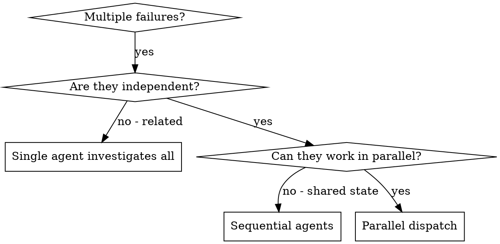

# Dispatching Parallel Agents

## Overview

Delegate independent work to specialized agents with isolated context. Each agent should receive only the instructions and evidence needed for its assigned domain.

When failures are unrelated, sequential investigation is slower and increases coordination overhead. Dispatch in parallel instead.

**Core principle:** one agent per independent problem domain.

## When to Use

Use this decision flow:



Use when:
- 3+ test files fail with different likely root causes
- Multiple subsystems appear broken independently
- Each issue can be understood without other issue context
- No shared state, lock ordering, or sequencing is required

Do not use when:
- Failures may share a root cause
- The system must be understood holistically first
- Agents would modify the same files heavily
- One investigation outcome determines the next investigation scope

## Workflow

### 1) Identify independent domains

Group by failing surface and likely root cause.

Example grouping:
- File A tests: tool approval flow
- File B tests: batch completion behavior
- File C tests: abort functionality

### 2) Craft focused agent tasks

Each task must include:
- Specific scope (single file/subsystem)
- Clear goal (what must pass or be fixed)
- Constraints (what not to change)
- Required output (summary and rationale)

### 3) Dispatch in parallel

```typescript
Task("Fix agent-tool-abort.test.ts failures")
Task("Fix batch-completion-behavior.test.ts failures")
Task("Fix tool-approval-race-conditions.test.ts failures")
```

### 4) Review and integrate

After all agents return:
1. Read each summary for root cause and fix details
2. Check for overlapping edits and conflicts
3. Run relevant tests and then full suite
4. Integrate only validated, non-conflicting changes

## Agent Prompt Template

Use this template per domain:

```markdown
Fix the failing tests in <path/to/test-file>:

Failing tests:
1. "<test name 1>" - <observed mismatch>
2. "<test name 2>" - <observed mismatch>
3. "<test name 3>" - <observed mismatch>

Context:
- <error snippet(s)>
- <key runtime signal or timing clue>

Your task:
1. Read the target test file and identify what each failing test verifies
2. Determine the root cause (test flake, race, or production bug)
3. Implement a fix in scope
4. Keep changes minimal and domain-contained

Constraints:
- Do not make broad refactors
- Do not edit unrelated files
- Do not "fix" by only increasing timeouts unless justified by evidence

Return:
- Root cause summary
- Exact files changed
- Why the fix is correct
- Any residual risk or follow-up checks
```

## Common Mistakes

- Too broad: "Fix all tests" -> poor focus
- Missing context: no failing names or error snippets
- Missing constraints: unnecessary refactors across the repo
- Vague output request: difficult review and integration

Prefer:
- single-domain scope
- concrete failure evidence
- explicit guardrails
- structured return format

## Real Example

Scenario:
- 6 failures across 3 files after refactor

Domains:
- `agent-tool-abort.test.ts` (3 failures, timing behavior)
- `batch-completion-behavior.test.ts` (2 failures, tool execution flow)
- `tool-approval-race-conditions.test.ts` (1 failure, execution ordering)

Dispatch:
- Agent 1 -> abort tests
- Agent 2 -> batch completion tests
- Agent 3 -> race-condition tests

Outcome:
- Independent fixes, no conflicts, full suite green after integration

## Verification Checklist

Before declaring done:
- [ ] Each agent reported root cause and scoped edits
- [ ] No conflicting edits across returned changes
- [ ] Targeted failing tests now pass
- [ ] Full relevant suite passes
- [ ] No new regressions introduced by integration

## Key Benefits

1. Parallel investigation across independent domains
2. Better focus from narrower context per agent
3. Lower coordination cost than sequential debugging
4. Faster recovery when failures are truly unrelated

## One-Screen Cheat Sheet

Quick go/no-go:
- If failures share likely root cause -> do **not** parallelize yet
- If domains are independent with low edit overlap -> parallelize
- If agents would edit same symbols/files -> split differently or run sequentially

Default dispatch prompt:

```markdown
Fix failures in `<test-file>` only.

Failing tests:
1. "<name>" - <mismatch>
2. "<name>" - <mismatch>

Evidence:
- <error output>
- <repro command>

Goal:
- Make these tests pass with minimal, domain-scoped changes.

Constraints:
- No broad refactors.
- No unrelated file edits.
- Do not mask with timeout increases without evidence.

Return:
- Root cause
- Files changed
- Why fix is correct
- Validation run and result
```

## Additional Resources

- For reusable prompt variants, independence checks, and conflict handling, see [reference.md](reference.md)
