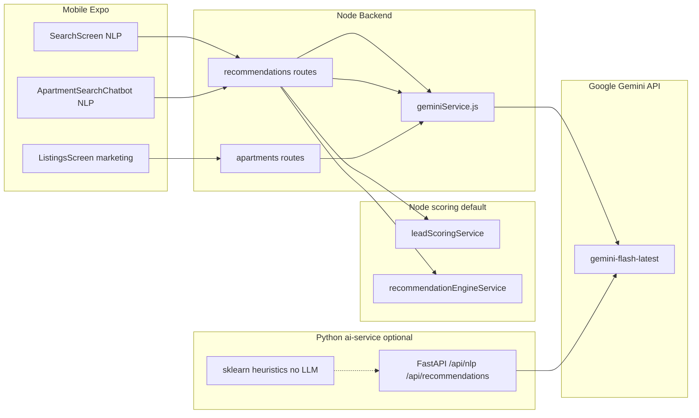

# אפיון יכולות AI במערכת (מצב נוכחי)

מסמך זה משקף את הקוד ב-repository נכון לייצוג תכולת AI זמינה במוצר.  
להחלטות ארכיטקטורה (Node מול `ai-service`): [`ADR_AI_Service_Strategy.md`](ADR_AI_Service_Strategy.md).

## ארכיטקטורה כללית

- **נתיב ייצור ראשי לאפליקציה**: ה-Backend ב-[`backend/src/services/geminiService.js`](../backend/src/services/geminiService.js) קורא ישירות ל-**Google Gemini** (`gemini-flash-latest` default). תלות: **`GEMINI_API_KEY`**.
- **דירוג נומרי (ללא LLM)**: Node ב-[`leadScoringService.js`](../backend/src/services/leadScoringService.js) / [`recommendationEngineService.js`](../backend/src/services/recommendationEngineService.js), עם proxy אופציונלי ל-`ai-service` ([`aiServiceClient.js`](../backend/src/services/aiServiceClient.js)).

---

## 1. NLP לחיפוש חופשי (Tenant)

| רכיב | תיאור |
|------|--------|
| **מה עושה** | הופך שאילתת טקסט חופשי (עברית/אנגלית) ל-**JSON מסונן**: עיר, שכונה, טווח מחירים, חדרים, amenities מוגדרים, חיות, תאריך כניסה. |
| **מודל** | Gemini Flash (`gemini-flash-latest`), `temperature: 0.1`, עד 256 טוקנים. |
| **כשל, JSON לא תקין או ללא מפתח** | **שכבת היוריסטיקה** (`inferFiltersFromQuery` ב-[`geminiService.js`](../backend/src/services/geminiService.js)): זיהוי ערים נפוצות, דפוסי חדרים/מחיר בעברית, מילות מפתח ל-amenities וחיות. התוצאה **ממוזגת** עם פלט Gemini (`mergeParsedFilters`) — ערכי LLM גוברים על קונפליקטים; חסרים משלימים מההיוריסטיקה. ללא מפתח: חיפוש עדיין מסונן לפי מה שניתן לחלץ מהטקסט. |
| **API** | `POST /api/recommendations/search` — דורש tenant מאומת; **הגבלת קצב** (`geminiSearchLimiter`); מיזוג overrides מה-body (city, maxPrice וכו'); **Redis cache** לפילטרים לפי שאילתה (מפתח עם גרסה, למשל `nlp:v3:…`, TTL ~5 דק'); שמירת היסטוריה ב-**MongoDB** `UserPreferences.nlpSearchHistory` (fire-and-forget); שאילתת Postgres על דירות פעילות, **לא כולל** דירות שכבר נוצפו ב-swipe. |
| **קוד** | [`backend/src/routes/recommendations.js`](../backend/src/routes/recommendations.js), [`backend/src/services/geminiService.js`](../backend/src/services/geminiService.js) — `parseSearchQuery`, `inferFiltersFromQuery`, `mergeParsedFilters`. |
| **מובייל** | [`mobile/src/screens/SearchScreen.tsx`](../mobile/src/screens/SearchScreen.tsx) — `recommendationsApi.nlpSearch`, ממשק "מחפש עם AI"; [`mobile/src/components/ApartmentSearchChatbot.tsx`](../mobile/src/components/ApartmentSearchChatbot.tsx) — אותו API בצ'אט צף לשוכרים. |

**הערה**: `GET /api/recommendations/personalized` משתמש במנוע דירוג Node ([`recommendationEngineService.js`](../backend/src/services/recommendationEngineService.js)); proxy ל-`ai-service` כש-`AI_SERVICE_URL` מוגדר.

---

## 2. יצירת טקסט שיווקי לדירה (Landlord)

| רכיב | תיאור |
|------|--------|
| **מה עושה** | יוצר **2–3 משפטים בעברית** לתיאור מודעה לפי נתוני דירה (עיר, חדרים, מחיר, שטח, קומה, amenities, חיות). |
| **סגנונות** | `professional` \| `friendly` \| `luxury` — הנחיות טון שונות ב-[`COPY_STYLE_INSTRUCTIONS`](../backend/src/services/geminiService.js). |
| **מודל** | Gemini Flash, `temperature: 0.75`, עד 160 טוקנים. |
| **API** | `POST /api/apartments/:id/marketing-copy` — בעלים בלבד; **Redis cache** לפי דירה+סגנון (10 דקות); ללא מפתח או כשל API → **503** עם הודעה על `GEMINI_API_KEY`. |
| **קוד** | [`backend/src/routes/apartments.js`](../backend/src/routes/apartments.js) (נתיב `/:id/marketing-copy`), [`geminiService.js`](../backend/src/services/geminiService.js) `generateMarketingCopy` / `generateListingSummary`. |
| **מובייל** | [`mobile/src/screens/ListingsScreen.tsx`](../mobile/src/screens/ListingsScreen.tsx) — מודאל לבחירת סגנון ויצירת טקסט, התראה אם אין מפתח בשרת. |

---

## 3. העדפות משתמש וטקסט שיווקי במובייל (ללא LLM עצמאי)

- **שמירה/טעינת העדפות** (`POST/GET /api/recommendations/preferences`): נתונים בלבד, ללא AI — משמש את ההמלצות האישיות והקשר ל-onboarding ([`PreferencesScreen.tsx`](../mobile/src/screens/PreferencesScreen.tsx), [`OnboardingScreen.tsx`](../mobile/src/screens/OnboardingScreen.tsx)).
- טקסט ב-onboarding כמו "AI מתאים לך לפי ההעדפות" מתאר את **הזרימה מבוססת-העדפות**, לא קריאת LLM נפרדת.

---

## 4. שירות Python `ai-service` (כפילות / הרחבה אופציונלית)

הפעלה נפרדת ([`ai-service/app.py`](../ai-service/app.py)):

| נתיב | יכולת |
|------|--------|
| `POST /api/nlp/parse` | אותו רעיון כמו `parseSearchQuery` — Gemini + Redis cache. |
| `POST /api/nlp/summary` | סיכום שיווקי בעברית — מקביל ל-`generate_listing_summary` ב-[`nlp_search.py`](../ai-service/src/nlp_search.py). |
| `POST /api/recommendations/score` | **דירוג נומרי** של רשימת דירות: numpy + התאמה להעדפות + boost התנהגותי לפי swipe — **לא מודל שפה** ([`recommendation_engine.py`](../ai-service/src/recommendation_engine.py)). |
| `POST /api/leads/score` | ציון לידים — כללי ניקוד, לא LLM. |

**Backend (ייצור):** [`leads.js`](../backend/src/routes/leads.js), [`recommendations.js`](../backend/src/routes/recommendations.js) (`POST /score`), [`landlord.js`](../backend/src/routes/landlord.js) (`leadScore` ב-`GET /leads`). **Mobile:** [`LeadsScreen.tsx`](../mobile/src/screens/LeadsScreen.tsx) מציג `leadScore`.

NLP ו-marketing copy **לא** מופנים ל-Python — רק Gemini דרך Node.

---

## 5. מה שאינו AI / גבולות

- **צ'אט בין משתמשים**: לא זוהה שימוש ב-LLM בנתיבי צ'אט ב-backend במסגרת הסריקה (התמקדנו ב-Gemini והשירותים לעיל).
- **מסמכי Info**: [`03_AI_Service.md`](03_AI_Service.md) מתאר ארכיטקטורה ו-Kafka; יש לטפל בו כמסמך תיאורי בלבד — **אין להעתיק מפתחות או פרטי סוד מהמסמך**.

---

## סיכום טבלה

| יכולת | LLM? | איפה בפועל (אפליקציה) |
|--------|------|-------------------------|
| חיפוש בשפה טבעית | כן (Gemini) + היוריסטיקה | Backend `recommendations/search`; מובייל Search + Chatbot |
| המלצות מותאמות אישית | לא (מנוע ניקוד Node) | Backend `recommendations/personalized`; `_score` ב-API |
| טקסט שיווקי למודעה | כן (Gemini) | Backend + moderation בסיסי ב-[`ListingsScreen.tsx`](../mobile/src/screens/ListingsScreen.tsx) |
| דירוג דירות מתקדם | לא | Node default; Python דרך `AI_SERVICE_URL` אופציונלי |
| ציון לידים | לא | Node + [`LeadsScreen.tsx`](../mobile/src/screens/LeadsScreen.tsx) |
