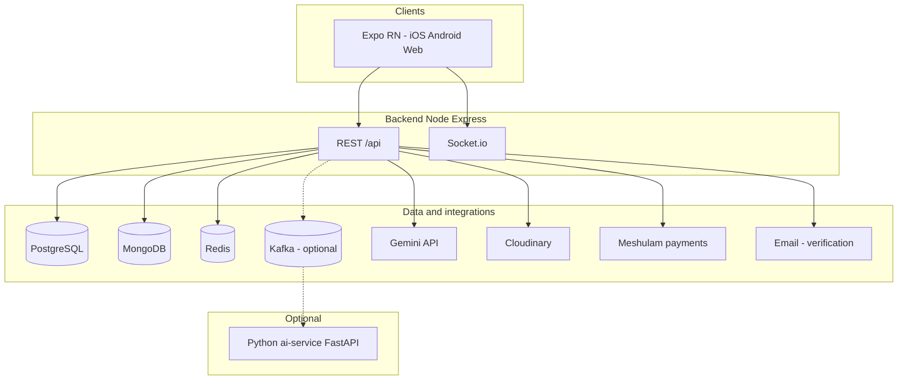
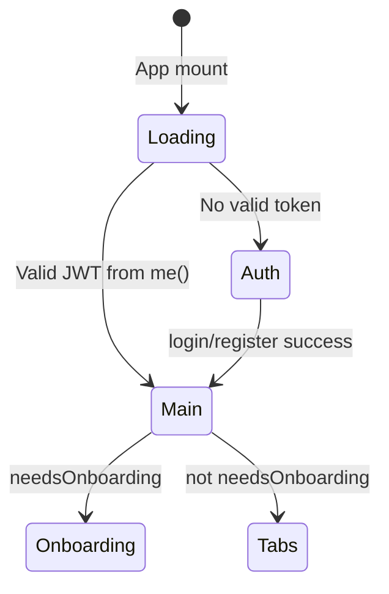
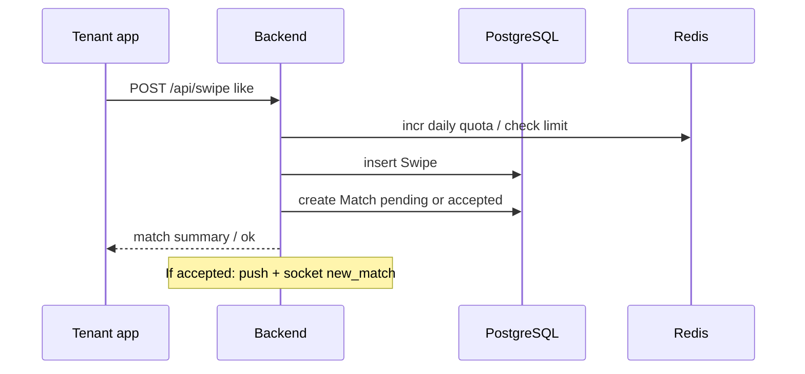

# DirApp - UI/UX Design Specification (Web + Mobile)

This document is a UI/UX-only specification for DirApp. It focuses on user journeys, information architecture, screen behavior, interaction patterns, visual language, accessibility, and responsive rules.

---

## 1. Product UX Goal

DirApp should feel:

- Fast and lightweight for daily housing tasks.
- Trustworthy for high-stakes decisions (renting, contracts, payments).
- Conversational and human in matchmaking and chat.
- Consistent across mobile app and web (same mental model, same flow hierarchy).

Primary users:

- Tenant: discover apartments, evaluate fit, connect with landlord.
- Landlord: list properties, manage leads, convert to signed tenant.

---

## 2. Information Architecture

### 2.1 Global nav model

- Unauthenticated: Auth flow only.
- Authenticated tenant: Bottom tabs + stack detail screens.
- Authenticated landlord: Bottom tabs + stack detail screens.

### 2.2 Tenant tab IA

1. Home (hub)
2. Swipe (primary discovery)
3. Matches (relationships + conversation)
4. Search (intent-driven filtering / NLP)
5. Map (location-first browsing)
6. Profile (account + settings + utilities)

### 2.3 Landlord tab IA

1. Home (hub)
2. Dashboard (performance summary)
3. Leads (qualified tenant list)
4. Matches (chat + status)
5. Listings (inventory management)
6. Profile (account + utilities)

### 2.4 Shared stack destinations

- Onboarding
- Chat
- Apartment detail
- Preferences
- Roommate
- Verify identity
- Contracts
- Rent payments
- Commercial
- Gamification
- Services
- IoT

---

## 3. Core User Journeys (UI Perspective)

### 3.1 Tenant primary funnel

1. Register/login.
2. Onboarding (if first tenant session).
3. Swipe apartment cards.
4. Open apartment detail when high intent.
5. Receive match / accepted lead.
6. Start chat.
7. Move to contracts and payment flows.

### 3.2 Landlord primary funnel

1. Register/login.
2. Create/edit listing.
3. Review leads.
4. Accept/reject leads.
5. Continue in chat.
6. Close via contracts/payments.

### 3.3 Secondary funnels

- Tenant: preferences -> better recommendations.
- Tenant: verify identity -> trust badge.
- Tenant: roommate flow -> compatibility search.
- Landlord: dashboard -> optimize listing and response behavior.

---

## 4. Screen Inventory and UX Rules

### 4.1 Auth screen

Purpose:

- Quick account entry with low friction.

UX rules:

- Keep login and registration in one clear switchable layout.
- Show password rules inline before submit.
- Use immediate field-level validation.
- Show one dominant CTA and one secondary CTA only.

### 4.2 Onboarding

Purpose:

- Gather preference context without making user feel like filling a form.

UX rules:

- Break into short steps.
- Show progress indicator.
- Allow back navigation without losing input.
- End each step with microcopy explaining benefit.

### 4.3 Home screen

Purpose:

- Role-based command center.

UX rules:

- Large tappable tiles.
- Group actions by intent, not by technical module.
- Keep most common actions in first viewport.

### 4.4 Swipe screen

Purpose:

- High-speed decision making on apartment cards.

UX rules:

- Card priority order: photo -> price -> location -> rooms -> key tags.
- Clear gesture affordances (left/right/super-like).
- Visible quota or usage status where relevant.
- Empty state must propose next best action (Search/Map).

### 4.5 Matches screen

Purpose:

- Single place for active and pending relationships.

UX rules:

- Distinguish pending vs accepted using color + label.
- Show unread count prominently.
- Most recent activity sorted first.

### 4.6 Chat screen

Purpose:

- Convert match into real interaction.

UX rules:

- Message bubbles with strong sender contrast.
- Typing indicator should appear subtle, not disruptive.
- Keep input always reachable above keyboard.
- Provide clear fail/retry pattern for send failures.

### 4.7 Search screen

Purpose:

- Intent-based discovery for users who know what they want.

UX rules:

- One free-text input + visible structured filters.
- Filter chips should be reversible in one tap.
- Preserve previous query state when returning to screen.

### 4.8 Map screen

Purpose:

- Location-first apartment discovery.

UX rules:

- Cluster markers at zoomed-out levels.
- Bottom sheet for selected listing preview.
- Keep map controls reachable by thumb on mobile.

### 4.9 Listings (landlord)

Purpose:

- Fast create/edit lifecycle for properties.

UX rules:

- Form sections: basics -> pricing -> amenities -> media -> publish state.
- Autosave draft for long forms.
- Image order should be draggable with clear cover-photo marker.

### 4.10 Leads and dashboard (landlord)

Purpose:

- Prioritize outreach and improve conversion.

UX rules:

- Dashboard cards highlight actionable metrics only.
- Leads list should expose quick actions (accept/reject/message).
- Keep status labels consistent with matches flow.

### 4.11 Profile

Purpose:

- Identity, account control, subscriptions, and utility links.

UX rules:

- Avatar and account summary at top.
- Premium section visually separated.
- Long menu grouped into: account, discovery, operations, system.

---

## 5. Interaction Design Principles

### 5.1 Micro-interactions

- Use subtle haptics on high-value actions (swipe confirm, accept match).
- Keep animation durations short (150-250ms for most transitions).
- Avoid decorative motion that delays task completion.

### 5.2 Feedback states

- Every async action should have one of: loading, success, inline error.
- Use inline toast/snackbar for non-blocking events.
- Use modal only for destructive or irreversible actions.

### 5.3 Empty states

Each empty state must include:

- What happened.
- Why it may be empty.
- Primary next action.

### 5.4 Error handling UX

- Human wording first, technical details hidden.
- Retry action always visible for network failures.
- Do not clear user input after failed submit.

---

## 6. Visual Design System Guidance

### 6.1 Visual tone

- Modern, clean, high trust.
- Accent usage should guide action, not decorate.
- Hebrew-first typography should maintain legibility at smaller sizes.

### 6.2 Component behavior standards

- Buttons: clear primary/secondary hierarchy.
- Cards: elevated but lightweight.
- Inputs: strong focus ring + clear error style.
- Chips/tags: compact, readable, removable.
- Bottom tabs: consistent icon metaphors by role.

### 6.3 Spacing and layout

- Use consistent vertical rhythm.
- Prefer compact information density on listing cards but breathable detail pages.
- Maintain safe-area padding on devices with notches and web headers.

---

## 7. Accessibility Requirements

- Touch targets: minimum 44x44.
- Text contrast: WCAG AA minimum.
- Never use color alone for status.
- Screen-reader labels for icons and critical actions.
- Logical focus order in forms and modals.
- Support dynamic text scaling without layout break for key flows.

---

## 8. Responsive Behavior (Web + App)

### 8.1 Shared rules

- Preserve navigation hierarchy between platforms.
- Preserve terminology and icon meaning.
- Keep flow steps identical where possible.

### 8.2 Mobile-first adjustments

- Prioritize thumb-zone controls.
- Keep primary CTAs docked or always visible in long forms.
- Full-screen overlays for focused tasks (chat, swipe, create listing).

### 8.3 Web adjustments

- Use wider content containers for dashboard, listings, and leads.
- Keep left/right margins generous for readability.
- Convert stacked cards to split layouts where context helps (e.g. map + list, leads + detail pane).

---

## 9. UX QA Checklist (Design Acceptance)

- Role-based navigation is correct for tenant and landlord.
- First-session onboarding appears only where intended.
- Swipe, match, and chat flows are reachable in under 3 taps from Home.
- Empty, loading, and error states exist on all core screens.
- Profile menu items are logically grouped and discoverable.
- Premium upsell does not block core free flow.
- Desktop/web layout remains usable without touch gestures.
- Accessibility checks pass on auth, swipe, chat, and listing creation.

---

## 10. Suggested Design Deliverables

For handoff and consistency, maintain:

1. User flow diagrams (tenant + landlord).
2. Low-fi wireframes for every major screen group.
3. High-fi components for card, list item, chat bubble, form sections.
4. Interaction specs for swipe, accept/reject, send message, upload listing.
5. State catalog (loading, empty, success, failure) per screen.
6. Responsive variants (mobile portrait, mobile landscape, desktop web).

---

## 11. Quick Summary

DirApp UI/UX should optimize for speed, trust, and clarity:

- Speed in discovery (swipe, search, map).
- Trust in identity, contracts, and payments.
- Clarity in role-based navigation and decision points.

This file is intentionally UI/UX-only and excludes backend architecture and API implementation detail.
# DirApp (ApartmentApp) — Application Reference & Workflow Guide

This document describes the product, technical architecture, API and realtime contracts, data model split, and **end-to-end user workflows** for **web** and **mobile** clients. Use it as the single reference when designing flows, QA journeys, or a dedicated web front-end that mirrors the app.

**Related docs:** [`README.md`](../README.md), [`00_Architecture_Overview.md`](00_Architecture_Overview.md), [`01_Mobile_Frontend.md`](01_Mobile_Frontend.md), [`02_Backend_Service.md`](02_Backend_Service.md), [`06_Data_Models_ERD.md`](06_Data_Models_ERD.md), [`10_API_WebSockets_Contracts.md`](10_API_WebSockets_Contracts.md), [`12_PRD_ApartmentApp.md`](12_PRD_ApartmentApp.md).

---

## 1. Product summary

**DirApp** is an Israeli apartment rental platform with a **Tinder-style swipe** discovery model, **natural-language search** (Google Gemini), **tenant–landlord matching**, **real-time chat** after acceptance, **landlord analytics and leads**, optional **premium billing** (Meshulam), and several extended modules (roommates, identity screening, digital contracts, rent payments, gamification, services marketplace, commercial/IoT).

Primary UI language in the client is **Hebrew** for many labels; this document is in English for engineering clarity.

---

## 2. Client applications: “web” vs “app”

There is **no separate Next.js or SPA web repository** in this monorepo. **Web and iOS/Android share one codebase:**

| Surface | Implementation | Notes |
|--------|----------------|--------|
| **Mobile app** | Expo / React Native (`mobile/`) | Native builds (EAS), Expo Go in dev |
| **Web app** | Same Expo project, React Native for Web | JWT in `localStorage`; global error handlers report to backend logs |
| **Backend API** | Node.js + Express (`backend/`) | REST under `/api/*`; Socket.io on the **same origin** as the API |

**Configuration**

- API origin: `EXPO_PUBLIC_API_URL` — must be the **origin only** (no `/api` suffix). See `mobile/src/services/apiConfig.ts`.
- Android emulator: `localhost` is rewritten to `10.0.2.2` for the dev API.
- Production: HTTPS required for the API URL; JWT and secrets enforced at server boot when `NODE_ENV=production` or `RENDER=true`.

**Token storage**

- **Native:** `expo-secure-store` key `auth_token`.
- **Web:** `localStorage` key `auth_token`.

Any “web workflow” you design should assume **the same screens and navigation** as mobile unless you build a second client.

---

## 3. High-level architecture

---

## 4. Roles and authentication

### 4.1 Roles

| Role | Capabilities (high level) |
|------|---------------------------|
| **tenant** | Swipe feed, matches, NLP search, map, preferences, roommate profile, verification, contracts, rent payments, gamification, services, commercial/IoT screens |
| **landlord** | Dashboard, leads, matches/chats, listings CRUD, marketing copy (Gemini), same profile-side modules where applicable |
| **admin** | Extra: **Logs Console** in Profile (audit + system log queries) |

### 4.2 Auth flow (REST)

1. **Register** `POST /api/auth/register` — body includes `email`, `password`, `firstName`, `lastName`, `role` (`tenant` \| `landlord`), optional `phone`. Response includes **JWT** and **user** object; client saves token.
2. **Login** `POST /api/auth/login` — email/password; returns JWT + user.
3. **Session restore** `GET /api/auth/me` — Bearer JWT; used on cold start.
4. **Logout** `POST /api/auth/logout` — client clears token regardless of response.
5. **Email verification** — verification link/token flow under `/api/auth/verify*` (see `backend/src/routes/auth.js` and `verify.js`). Swipe for tenants requires **verified** account (`requireVerified` on swipe routes).
6. **Profile** — `PATCH /api/auth/profile`, avatar `PATCH /api/auth/avatar` (multipart).
7. **Push** — `PATCH /api/auth/push-token` for device notifications (native).

### 4.3 Client auth state (Zustand)

`mobile/src/store/useAuthStore.ts`:

- After **register**, `needsOnboarding === true` only when **`role === 'tenant'`** (landlords skip onboarding in this flag).
- After **restoreSession**, `needsOnboarding` is set to **false** (onboarding is not re-evaluated from server in restore path).
- **401** on API calls clears token (`mobile/src/services/api.ts` interceptor).

### 4.4 Navigation gate

Root stack: **Auth** vs **Main**. **Main** stack starts at **Onboarding** or **Tabs** based on `needsOnboarding`.

---

## 5. Screen map and navigation structure

Implementation: `mobile/src/navigation/AppNavigator.tsx`.

### 5.1 Root

| Screen | When |
|--------|------|
| **Auth** | Not authenticated |
| **Main** | Authenticated |

### 5.2 Main stack (modal / detail flows)

| Route | Who | Purpose |
|-------|-----|---------|
| **Tabs** | Both | Role-specific bottom tabs (see below) |
| **Onboarding** | Tenant (initial) | First-run tenant onboarding |
| **Chat** | Both | Conversation for a match |
| **ApartmentDetail** | Both | Listing detail |
| **CreateListing** | Landlord | New listing (multipart + fields) |
| **EditListing** | Landlord | Edit listing |
| **Preferences** | Tenant | Search preferences (saved to recommendations API) |
| **Roommate** | Tenant | Roommate profile + matches |
| **VerifyIdentity** | Tenant | Identity screening UI |
| **Contracts** | Both | Digital agreements |
| **RentPayments** | Both | Rent payment requests / pay / mark paid |
| **Commercial** | Both | Commercial leases (uses `api.get('/commercial')` etc.) |
| **Gamification** | Both | Points / leaderboard |
| **Services** | Both | Services marketplace |
| **IoT** | Both | Devices + maintenance tickets |
| **LogsConsole** | Admin | Audit + system logs |

### 5.3 Tenant bottom tabs

| Tab | Screen | Purpose |
|-----|--------|---------|
| Home | `HomeScreen` | Hub tiles → navigate to tab routes |
| Swipe | `SwipeScreen` | Card swipe feed |
| Matches | `MatchesScreen` | Match list → Chat |
| Search | `SearchScreen` | Filters + NLP search |
| Map | `MapScreen` | Map-based discovery |
| Profile | `ProfileScreen` | Account, premium, deep links to stack screens |

**Floating UI:** `ApartmentSearchChatbot` is rendered **above tenant tabs** (global assistant).

### 5.4 Landlord bottom tabs

| Tab | Screen |
|-----|--------|
| Home | `HomeScreen` |
| Dashboard | `LandlordDashboard` |
| Leads | `LeadsScreen` |
| Matches | `MatchesScreen` (labeled as chats) |
| Listings | `ListingsScreen` |
| Profile | `ProfileScreen` |

### 5.5 Profile menu → stack routes (from `ProfileScreen.tsx`)

Entries are **role-aware** where noted:

- **Preferences** — tenant only  
- **Roommate** — tenant only  
- **VerifyIdentity** — tenant only  
- **Contracts**, **RentPayments**, **Commercial**, **Gamification**, **Services**, **IoT** — all roles in UI  
- **LogsConsole** — `user.role === 'admin'`  
- Placeholders: Notifications, Privacy (alerts / “coming soon”)  
- **Premium:** `POST /api/payments/premium` → open `paymentUrl` in browser (`Linking.openURL`)

---

## 6. Core domain workflows

### 6.1 Swipe → match lifecycle

**Business rules** (`backend/src/services/matchingService.js`):

1. Tenant swipes **like** or **superlike** on an apartment → server may create a **Match** row.
2. **Duplicate prevention:** one match per `(tenantId, apartmentId)`.
3. **Landlord pre-like:** If the landlord has previously swiped **like** on this **tenant** (stored with `tenantId: landlordId` and `apartmentId: tenantId` — inverted IDs for landlord-interest swipe), match is **`accepted`** immediately; otherwise **`pending`** with **7-day expiry**.
4. **Landlord accept** `POST /api/matches/:id/accept` → status `accepted`, notifications, socket hint to join chat room.
5. **Landlord reject** `POST /api/matches/:id/reject` → removes pending lead.

**Tenant swipe API** (`POST /api/swipe`):

- Requires **verified** tenant (`requireVerified`).
- **Daily quota:** free users — **20 swipes/day** (Redis key per user per date); premium users unlimited (`requirePremium` logic via `isPremium`).
- Directions: `like` | `dislike` | `superlike`.
- **Undo:** `DELETE /api/swipe/last`.
- **Quota read:** `GET /api/swipe/quota`.

### 6.2 Matches list

- `GET /api/matches` — cached ~60s in Redis per role/user; includes apartment + counterparty + **unread counts** from MongoDB messages when available.

### 6.3 Realtime chat (Socket.io)

**Connection:** client connects to **API origin** with `auth: { token: JWT }`. Transports: polling + websocket upgrade (important for mobile networks and proxies).

**Server → client events** (non-exhaustive, see `backend/src/config/socket.js`):

| Event | Meaning |
|-------|---------|
| `new_message` | Message payload broadcast to room `chat:{matchId}` |
| `user_typing` / `user_stop_typing` | Typing indicators |
| `messages_read` | Read receipts sync |
| `new_match` | Match created/accepted (to `user:{userId}`) |
| `join_chat_room` | Instruction to join a match room (client then emits `join_chat`) |

**Client → server events:**

| Event | Payload | Meaning |
|-------|---------|---------|
| `join_chat` | `matchId` | Join `chat:{matchId}` |
| `leave_chat` | `matchId` | Leave room |
| `send_message` | `{ matchId, content, type?, imageUrl? }` | Persist + broadcast; **ack** callback with success/error |
| `typing` / `stop_typing` | `{ matchId }` | Typing state |

**REST fallback for history:** `GET /api/chat/:matchId`, send `POST /api/chat/:matchId`, read `PATCH /api/chat/:matchId/read`.

> **Note:** Older internal docs may say `join_match` / `receive_message`. The **implemented** protocol uses **`join_chat`** and **`new_message`** — align new clients and tests with the code above.

### 6.4 Apartments feed and listings

- **Feed:** `GET /api/apartments/feed` — paginated, Redis-cached swipe candidates.
- **Detail:** `GET /api/apartments/:id`.
- **Landlord create:** `POST /api/apartments` (multipart).
- **Update / freeze / delete:** `PATCH`, `POST .../freeze`, `DELETE`.
- **Marketing copy:** `POST /api/apartments/:id/marketing-copy` with `style`: professional \| friendly \| luxury.

### 6.5 NLP / recommendations

- **Search:** `POST /api/recommendations/search` — natural language + optional overrides (city, price, rooms, pets).
- **Personalized:** `GET /api/recommendations/personalized`.
- **Preferences:** `GET/POST /api/recommendations/preferences` — aligns with **Preferences** screen.

### 6.6 Landlord dashboard and leads

- `GET /api/landlord/dashboard` — analytics snapshot.
- `GET /api/landlord/leads` — ranked / filtered leads (`status`, pagination).

### 6.7 Payments

- **Premium:** `POST /api/payments/premium` — returns provider URL (Meshulam); webhook/backend updates `is_premium` on user (see billing docs).
- **Rent:** `POST /api/payments/rent`, `GET /api/payments/rent`, `POST /api/payments/rent/:id/pay`, `POST /api/payments/rent/:id/mark-paid`.

### 6.8 Screening (identity)

- `POST /api/screening/identity`, `GET /api/screening/status`, `GET /api/screening/tenant/:userId`.

### 6.9 Roommates

- `GET/POST /api/roommates/profile`, `GET /api/roommates/matches`.

### 6.10 Contracts

- `POST /api/contracts`, `POST /api/contracts/upload` (multipart + document), `GET /api/contracts`, `GET /api/contracts/:id`, `POST .../sign`, `POST .../deposit`.

### 6.11 Gamification

- `GET /api/gamification/me`, `POST /api/gamification/award`, `GET /api/gamification/leaderboard`.

### 6.12 Services marketplace

- `GET /api/services`, `POST /api/services`, `GET/PATCH/DELETE` by id, `POST .../review`.

### 6.13 Commercial / IoT

- Commercial leases: `/api/commercial` (see `backend/src/routes/commercial.js`; client may call `api.get('/commercial')` from `CommercialScreen`).
- IoT: `/api/iot/devices`, `/api/iot/access`, `/api/iot/maintenance` (see `mobile/src/services/api.ts` `iotApi`).

### 6.14 Logging and observability

- **Client events:** `POST /api/logs/client-event` — used for web startup, socket connect/errors, HTTP errors (with loop guard).
- **Admin:** `GET /api/admin/logs/audit`, `GET /api/admin/logs/system`, CSV export for audit.

---

## 7. Data stores (persistence)

| Store | Typical content |
|-------|-----------------|
| **PostgreSQL** | Users, Apartments, Swipes, Matches — ACID core |
| **MongoDB** | Messages, UserPreferences, and other document models (contracts, roommates, etc. per `backend/src/models/mongo/`) |
| **Redis** | Feed/session/NLP cache, swipe daily quota, match list cache, push token cache keys |

If MongoDB is down, chat history features degrade gracefully (e.g. unread counts fallback).

---

## 8. End-to-end workflow catalog

Use these as **BDD / E2E scenario** outlines. Prefix each with: *Given API is reachable and test user exists*.

### 8.1 Tenant: first install → onboarding → swipe

1. Open app (web or native) → **Auth**.
2. Register as tenant → token saved → **Main** with **Onboarding** first.
3. Complete onboarding → **Tabs** (tenant).
4. Open **Swipe** → `GET /api/apartments/feed` loads cards.
5. Verify email if required → until `user.isVerified`, swipe returns **403/verification** path per backend rules.
6. Swipe right → `POST /api/swipe` → optional **Match** pending or accepted.
7. Check **Matches** → `GET /api/matches`.

### 8.2 Tenant: chat after accepted match

1. Landlord accepts pending match (or mutual-like auto-accept).
2. Socket connects on **Main** mount (`useChatStore.connect()` in `AppNavigator`).
3. Open **Chat** for match → `join_chat`, load history via `GET /api/chat/:matchId`.
4. Send message → prefer **socket** `send_message` with ack; REST available.
5. Observe **new_message** on other client; typing indicators via `typing` / `stop_typing`.

### 8.3 Tenant: NLP search and preferences

1. **Search** tab or **ApartmentSearchChatbot** → user query.
2. `POST /api/recommendations/search` → listing results; tap → **ApartmentDetail** (or swipe from feed).
3. **Profile → Preferences** → `POST /api/recommendations/preferences`.

### 8.4 Tenant: premium upgrade

1. **Profile → Upgrade** → `POST /api/payments/premium`.
2. Complete payment on Meshulam page; return to app → `GET /api/auth/me` or next swipe to confirm `isPremium` and quota.

### 8.5 Landlord: publish listing → receive lead → accept

1. Register/login as landlord → **Tabs** (no tenant onboarding).
2. **Listings → Create** → `POST /api/apartments` with images.
3. Tenant likes listing → landlord sees **Leads** / **Matches** as pending.
4. **Leads** screen review → **Matches** accept `POST /api/matches/:id/accept`.
5. Chat unlocks for both.

### 8.6 Landlord: analytics

1. **Dashboard** → `GET /api/landlord/dashboard`.
2. Optional: marketing copy on listing → `POST /api/apartments/:id/marketing-copy`.

### 8.7 Extended modules (both roles unless noted)

| Workflow | APIs (primary) |
|----------|------------------|
| Roommate search | `/api/roommates/*` |
| Identity verification | `/api/screening/*` |
| Contracts lifecycle | `/api/contracts/*` |
| Rent collection | `/api/payments/rent*` |
| Gamification | `/api/gamification/*` |
| Services | `/api/services*` |
| Commercial leases | `/api/commercial*` |
| IoT | `/api/iot/*` |
| Admin log review | `/api/admin/logs/*` + **LogsConsole** |

### 8.8 Web-specific checks

1. **CORS:** backend allows origins from `CLIENT_ORIGIN` / `CLIENT_ORIGINS` (comma-separated); optional Vercel preview flag.
2. **Storage:** token in `localStorage`; private mode may break persistence.
3. **Global errors:** `AppNavigator` registers `window.error` / `unhandledrejection` → `clientLogsApi.event`.
4. **Confirm/alert:** Profile logout uses `window.confirm` on web.

---

## 9. Optional services

| Component | Purpose |
|-----------|---------|
| **Kafka** | Event bus toward AI / lead scoring (optional in small deploys) |
| **ai-service (FastAPI)** | NLP parsing, recommendations, lead scoring when wired |
| **Docker Compose** | Local Postgres, Mongo, Redis, Kafka |

---

## 10. Quick API index (mount paths)

All REST routes are registered in `backend/src/app.js`:

| Mount prefix | Module |
|--------------|--------|
| `/api/auth` | `auth`, `verify` |
| `/api/apartments` | apartments |
| `/api/swipe` | swipe |
| `/api/matches` | matches |
| `/api/chat` | chat |
| `/api/recommendations` | recommendations |
| `/api/landlord` | landlord |
| `/api/payments` | payments |
| `/api/roommates` | roommates |
| `/api/screening` | screening |
| `/api/contracts` | contracts |
| `/api/commercial` | commercial |
| `/api/gamification` | gamification |
| `/api/services` | services |
| `/api/iot` | iot |
| `/api/admin/logs` | adminLogs |
| `/api/logs` | logs (client events) |

**Health:** `GET /health`.

---

## 11. Building a dedicated “web-only” product later

If you split a **Next.js** (or other) web app from Expo Web:

1. Reuse the **same REST and Socket.io contracts** (sections 6.3 and 10).
2. Reimplement **navigation parity**: tenant vs landlord tabs + main stack routes.
3. Replace **SecureStore** with httpOnly cookies **only if** you change auth to cookie-based sessions (currently **JWT Bearer** only).
4. Keep **verified-tenant gating** and **swipe quota** UX aligned with `GET /api/swipe/quota`.
5. Mirror **role-based** menu entries from `ProfileScreen`.

---

*Document generated from repository state: backend `app.js`, `matchingService.js`, `socket.js`, `swipe.js`, `matches.js`, mobile `AppNavigator.tsx`, `api.ts`, `useAuthStore.ts`, `ProfileScreen.tsx`, and `README.md`.*
