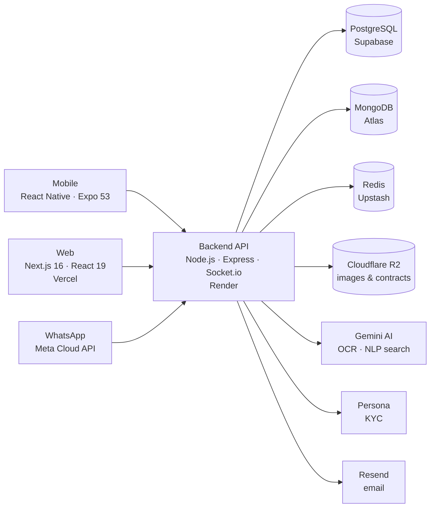

# DirApp — Apartment Rental Platform 🏠

> A full-stack, production-deployed rental platform for the Israeli market — from Tinder-style apartment discovery, through digital lease signing with KYC identity verification, to ongoing rent ledger, maintenance and WhatsApp automation.

**Live demo:** [apartment-olive.vercel.app](https://apartment-olive.vercel.app) · **API:** [apartment-backend-v24y.onrender.com/health](https://apartment-backend-v24y.onrender.com/health)

> **Try it yourself** — log in with the demo account: `demo@dirapp.com` / `DirappDemo2026!` (tenant role — swipe the feed, match, chat, search in natural language). *Note: the API runs on a free tier and may take ~30s to wake up on first request.*


---

## What it does

**For tenants** — swipe through apartments, match with landlords, chat in real time, search in natural language ("3 rooms in Tel Aviv near the beach under 6000₪" → parsed by Gemini AI), sign a lease digitally, report rent payments, open maintenance tickets — even via WhatsApp.

**For landlords** — ranked leads with AI lead-scoring, contract upload with AI (OCR) analysis, a full lease lifecycle engine (`DRAFT → READY_SIGN → SIGNED → ACTIVE → ENDED`), automatic rent ledger with CPI indexation, check-in/check-out photo protocols, and an analytics dashboard.

**For admins** — config panel (50+ runtime keys), user management, KYC overrides, and a stats dashboard with 56 metrics across 8 sections.

## Feature highlights

| Domain | Highlights |
|--------|-----------|
| 🔍 Discovery | Swipe feed (Redis-cached), matching engine, real-time chat (Socket.io), NLP search |
| 🪪 Identity (KYC) | Persona integration, HMAC-SHA256 webhooks, auto photo retention/deletion (7 days) |
| 📋 Contracts | Upload + Gemini OCR analysis, digital signing, validation gates, guarantor web flow, amendments & renewals |
| 💰 Payments | Auto-seeded payment ledger (12 rows on signing), tenant report → landlord confirm → auto-confirm 48h, overdue alerts, CPI indexation cron |
| 🏡 Check-in/out | Room-by-room photo protocols on Cloudflare R2, mutual declarations, 3-round repair cycles |
| 📱 WhatsApp | Meta Cloud API integration — 8 Hebrew templates, conversational state machine, payment confirmation & maintenance tickets from chat |
| 🔔 Notifications | Expo Push + transactional email (Resend), scheduled cron alerts (lease expiry 120/90/60/45/30 days) |
| 🛡️ Trust & Safety | Trust Score engine, audit log, GDPR endpoints (export / deletion), rate limiting |

## Architecture



Full details: [ARCHITECTURE.md](ARCHITECTURE.md) · DB schema docs: [docs/obsidian-db](docs/obsidian-db) · System design specs: [Info/](Info/)

## Tech stack

| Layer | Technology |
|-------|-----------|
| Web | Next.js 16, React 19, Tailwind, shadcn/ui, SWR, react-hook-form + Zod |
| Mobile | React Native 0.79 (Expo 53), Zustand, Reanimated |
| Backend | Node.js, Express, Sequelize (PostgreSQL), Mongoose (MongoDB), Socket.io |
| Data | PostgreSQL (core domain), MongoDB (chat/preferences), Redis (cache), Cloudflare R2 (objects) |
| AI | Gemini (contract OCR, NLP search, marketing copy); optional Python FastAPI scoring service |
| Integrations | Persona (KYC), WhatsApp Meta Cloud API, Resend (email), Expo Push |
| Ops | Render (API, auto-deploy), Vercel (web), GitHub Actions CI, node-cron jobs, Jest (50+ suites) |

## Repository structure

```
├── backend/          Node.js REST + WebSocket API (30 route modules, 24 services, 54 test suites)
├── web-next/         Next.js web client — 26 pages (deployed to Vercel)
├── mobile/           React Native (Expo) app
├── ai-service/       Python FastAPI — recommendation & lead-scoring (optional)
├── infrastructure/   Kubernetes manifests (alternative deploy target)
├── docs/             Product specs, DB schema vault, internal plans
├── Info/             System design docs (HLD/LLD, ERD, security, CI/CD)
└── docker-compose.yml  Local dev environment
```

## Running locally

```bash
# Infrastructure
docker compose up -d postgres mongodb redis

# Backend (http://localhost:3000)
cd backend && cp .env.example .env && npm install && npm run dev

# Web (http://localhost:3001)
cd web-next && npm install && npm run dev

# Mobile
cd mobile && npm install && npx expo start

# Tests
cd backend && npm test
```

Required keys are documented in `backend/.env.example` (Gemini, R2, Persona, Resend — all have free tiers).

## Engineering process

This project is built with an AI-orchestrated multi-agent workflow (Claude Code as orchestrator, with parallel agent worktrees), with disciplined status tracking:

- [MASTER.md](MASTER.md) — single source of truth for feature status (verified-in-production matrix)
- [BUGS.md](BUGS.md) — bug triage with root-cause analysis
- [ROADMAP.md](ROADMAP.md) — milestone planning (M1–M16 + V2)
- CI on every push (GitHub Actions), auto-deploy to Render/Vercel, Jest coverage gates

---

*Built by [Ran Ram](https://github.com/RanRam29) · 2026*
