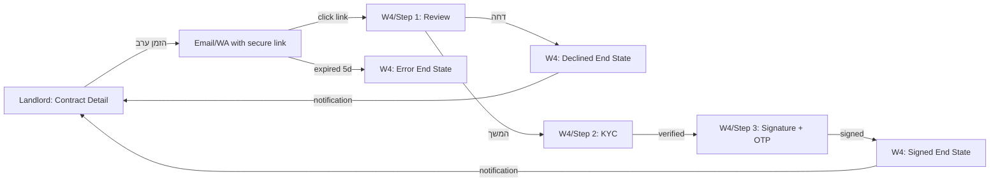

# DirApp — User Flow Map & Navigation Guide
> Paste this AFTER `00-GLOBAL-CONTEXT.md`. Defines WHERE every button leads and WHAT conditions gate transitions.

---

## 1. Main Lifecycle — Tenant Journey

```mermaid
graph TD
    W1[W1: Landing Page] -->|"הצטרף כשוכר"| W2_R[W2: Register]
    W1 -->|"אני משכיר"| W2_R
    W2_R -->|success| W2_V[W2: Email Verification]
    W2_V -->|verified| W3[W3: Tenant Dashboard]
    W2_L[W2: Login] -->|success + ToS accepted| W3
    W2_L -->|success + ToS NOT accepted| M1_7[ToS Screen]
    M1_7 -->|accepted| W3

    W3 -->|"חפש דירה"| W6_2[W6/P2: Search Grid]
    W3 -->|"צפה בהתאמות"| W6_4[W6/P4: Matches]
    W3 -->|"בדוק תשלומים"| W7_4[W7/P4: Ledger]
    W3 -->|"דירות מומלצות → ראה הכל"| W6_2
    W3 -->|"חוזים פעילים → צפה"| W7_2[W7/P2: Contract Detail]
    W3 -->|"חוזים פעילים → ראה הכל"| W7_1[W7/P1: Contracts List]
    W3 -->|"Trust Score → שפר"| W8_3[W8/P3: Gamification]
    W3 -->|"התראות → ראה הכל"| W9_1[W9/P1: Notifications]
    W3 -->|"יומן → ראה הכל"| W8_2[W8/P2: Renter Journal]
    W3 -->|apartment card click| W6_3[W6/P3: Apartment Detail]

    W6_2 -->|card "פרטים"| W6_3
    W6_2 -->|"אני מעוניין"| MATCH_CHECK{KYC + ToS?}
    W6_3 -->|"אני מעוניין/ת"| MATCH_CHECK
    MATCH_CHECK -->|yes| MATCH[Match Created → Notification]
    MATCH_CHECK -->|no KYC| M4_7[KYC Screen]
    MATCH_CHECK -->|no ToS| M1_7

    MATCH -->|landlord approves| W6_5[W6/P5: Chat]
    W6_5 -->|property banner click| W6_3
    W6_4 -->|card click (approved)| W6_5
    W6_4 -->|card click (pending)| W6_3

    W6_5 -.->|"landlord sends contract"| W7_2
    W7_2 -->|"חתום על החוזה"| SIGN_CHECK{KYC verified?}
    SIGN_CHECK -->|yes| W7_SIGN[Signing Modal]
    SIGN_CHECK -->|no| M4_7
    W7_SIGN -->|signed by both| CONTRACT_ACTIVE[Contract ACTIVE]

    CONTRACT_ACTIVE -->|check-in window| W7_6[W7/P6: Check-In]
    CONTRACT_ACTIVE -->|monthly| W7_4
    CONTRACT_ACTIVE -->|issue| W7_5[W7/P5: Maintenance]
    CONTRACT_ACTIVE -->|expiring 60d| RENEW[Renewal Flow]
    CONTRACT_ACTIVE -->|end of contract| W7_6_OUT[W7/P6: Check-Out]
```

## 2. Main Lifecycle — Landlord Journey

```mermaid
graph TD
    W2_L[W2: Login] -->|landlord role| W8_4[W8/P4: Landlord Dashboard]

    W8_4 -->|"נכסים: 3" KPI| W8_4_PROP[W8/P4: Properties Grid]
    W8_4 -->|"לידים: 7" KPI| W8_5[W8/P5: Leads Management]
    W8_4 -->|"תשלומים ממתינים" KPI| W7_4[W7/P4: Ledger]
    W8_4 -->|"תקלות" KPI| W7_5[W7/P5: Maintenance]
    W8_4 -->|"הוסף נכס +"| CREATE[Create Listing Form]
    W8_4 -->|lead card "אשר"| LEAD_APPROVE[Lead → Chat opens]
    W8_4 -->|lead card "דחה"| LEAD_REJECT[Lead rejected → notification to tenant]
    W8_4 -->|pending payment "אשר ✓"| PAY_CONFIRM[Payment → PAID]
    W8_4 -->|pending payment "דחה ✗"| PAY_REJECT[Payment rejected → notification]

    W8_5 -->|side panel "אשר → חוזה"| W7_3[W7/P3: Contract Upload]
    W8_5 -->|"שלח הודעה"| W6_5[W6/P5: Chat]

    W7_1[W7/P1: Contracts List] -->|"העלה חוזה"| W7_3
    W7_3 -->|step 3 "שלח לחתימה"| W7_2[W7/P2: Contract Detail]
    W7_2 -->|"הזמן ערב"| GUARANTOR_INVITE[Invite → sends link to W4]
```

## 3. Guarantor Flow (Cross-Platform)



## 4. Admin Flow

```mermaid
graph TD
    W2_L[W2: Login admin role] --> W5_1[W5/P1: Admin Dashboard]
    W5_1 -->|"תקלות פתוחות" card| W5_MAINT[Admin: Maintenance via sidebar]
    W5_1 -->|"חוזים פגים" card| W5_CONT[Admin: Contracts via sidebar]
    W5_1 -->|"ראה הכל" activity| W5_LOGS[Admin: Logs via sidebar]
    W5_1 -->|sidebar "משתמשים"| W5_2[W5/P2: User Management]
    W5_1 -->|sidebar "הגדרות"| W5_3[W5/P3: Config Panel]
    W5_2 -->|user row "ערוך"| W5_2_EDIT[Edit User Modal]
    W5_2 -->|"עקוף KYC"| KYC_OVERRIDE[KYC Override]
    W5_2 -->|"מחק"| DELETE_CONFIRM[Cascading Delete Confirm]
```

---

## 5. Navigation Tables — Web

### W3: Tenant Dashboard

| Element | Action | Target | Condition |
|---------|--------|--------|-----------|
| Sidebar "חיפוש דירות" | navigate | W6/P2: Search Grid | — |
| Sidebar "ההתאמות שלי" | navigate | W6/P4: Matches | — |
| Sidebar "הודעות" | navigate | W6/P5: Chat List | — |
| Sidebar "החוזים שלי" | navigate | W7/P1: Contracts List | — |
| Sidebar "תשלומים" | navigate | W7/P4: Ledger | — |
| Sidebar "תקלות" | navigate | W7/P5: Maintenance | — |
| Sidebar "היומן שלי" | navigate | W8/P2: Renter Journal | — |
| Sidebar "נקודות ודירוג" | navigate | W8/P3: Gamification | — |
| Sidebar "הגדרות" | navigate | W8/P1: Profile & Settings | — |
| Sidebar "התנתק" | logout | W2/P1: Login | confirm dialog |
| Top bar bell icon | navigate | W9/P1: Notifications | — |
| Top bar search | navigate | W6/P2: Search Grid (with query) | — |
| Top bar avatar dropdown "התנתק" | logout | W2/P1: Login | confirm dialog |
| Quick action "חפש דירה" | navigate | W6/P2: Search Grid | — |
| Quick action "צפה בהתאמות" | navigate | W6/P4: Matches | — |
| Quick action "בדוק תשלומים" | navigate | W7/P4: Ledger | — |
| Apartment card click | navigate | W6/P3: Apartment Detail | — |
| "דירות מומלצות → ראה הכל" | navigate | W6/P2: Search Grid | — |
| Contracts table row "צפה" | navigate | W7/P2: Contract Detail | — |
| Contracts table "ראה הכל" | navigate | W7/P1: Contracts List | — |
| Trust Score "→ שפר" | navigate | W8/P3: Gamification | — |
| "התראות אחרונות → ראה הכל" | navigate | W9/P1: Notifications | — |
| Notification item click | navigate | context screen (see §8) | — |
| "יומן אחרון → ראה הכל" | navigate | W8/P2: Renter Journal | — |
| Journal entry "→ צפה" | navigate | related detail screen | — |

### W6: Discovery, Matches & Chat

| Element | Action | Target | Condition |
|---------|--------|--------|-----------|
| **P1 Swipe** — card ❌ | swipe left | next card | — |
| **P1 Swipe** — card 💚 | create match | Match modal → W6/P4 | ToS accepted |
| **P1 Swipe** — card ⭐ | superlike | Match modal → W6/P4 | quota not exceeded |
| **P1 Swipe** — mini card click (right panel) | navigate | W6/P3: Apartment Detail | — |
| **P1 Swipe** — match modal "שלח הודעה" | navigate | W6/P5: Chat (new convo) | match approved |
| **P1 Swipe** — quota modal "שדרג" | open | Premium upgrade flow | — |
| **P2 Search** — card "פרטים" | navigate | W6/P3: Apartment Detail | — |
| **P2 Search** — card "אני מעוניין" | create match | Match flow | KYC + ToS |
| **P2 Search** — NLP toggle | switch mode | NLP text input (same page) | — |
| **P3 Detail** — "אני מעוניין/ת" CTA | create match | Match flow | KYC + ToS |
| **P3 Detail** — "שמור" | add favorite | stays on page | — |
| **P3 Detail** — "דווח" | open modal | Report modal (same page) | — |
| **P3 Detail** — "ערוך מודעה" (owner view) | navigate | Edit Listing form | user is owner |
| **P3 Detail** — landlord card "שלח הודעה" | navigate | W6/P5: Chat | match exists |
| **P3 Detail** — landlord card "צפה בפרופיל" | open modal | Landlord Profile modal | — |
| **P4 Matches** — card click (approved) | navigate | W6/P5: Chat | — |
| **P4 Matches** — card click (pending, tenant) | navigate | W6/P3: Apartment Detail | — |
| **P4 Matches** — landlord "אשר ✓" | approve lead | opens Chat + notification to tenant | — |
| **P4 Matches** — landlord "דחה ✗" | reject lead | notification to tenant | confirm dialog |
| **P5 Chat** — conversation item click | open chat | Chat conversation (same page, center panel) | — |
| **P5 Chat** — property banner click | navigate | W6/P3: Apartment Detail | — |
| **P5 Chat** — right panel "חסום" | block user | confirm dialog | — |

### W7: Contracts, Payments & Maintenance

| Element | Action | Target | Condition |
|---------|--------|--------|-----------|
| **P1 List** — "העלה חוזה" button | navigate | W7/P3: Contract Upload | landlord only |
| **P1 List** — table row "צפה" | navigate | W7/P2: Contract Detail | — |
| **P1 List** — table row "חתום" | navigate | W7/P2 → Signing Modal | KYC verified |
| **P1 List** — dropdown "amendment" | open modal | Amendment modal on W7/P2 | contract ACTIVE |
| **P1 List** — dropdown "renew" | navigate | Renewal flow on W7/P2 | contract EXPIRING |
| **P1 List** — dropdown "PDF" | download | PDF file | — |
| **P2 Detail** — "חתום על החוזה" | open modal | Signing Modal (canvas) | KYC verified |
| **P2 Detail** — "חתום" blocked | navigate | KYC screen (W8/P1 or inline) | KYC NOT verified |
| **P2 Detail** — "אמת בעלות" | open modal | Ownership Verification modal | tenant, contract ACTIVE |
| **P2 Detail** — "הצע תיקון" | open modal | Amendment modal | contract ACTIVE, <10 amendments |
| **P2 Detail** — "הורד PDF" | download | PDF file | — |
| **P2 Detail** — "חדש חוזה" | navigate | W7/P3 pre-filled renewal | contract EXPIRING |
| **P2 Detail** — "הזמן ערב" | open modal | Guarantor Invite → sends email/WA link to W4 | landlord, contract PENDING |
| **P3 Upload** — step 3 "שלח לחתימה" | navigate | W7/P2: Contract Detail (new) | — |
| **P4 Ledger** — tenant "דווח תשלום" | open modal | Report Payment modal | row is PENDING |
| **P4 Ledger** — landlord "אשר ✓" | confirm | row → PAID + notification to tenant | row is REPORTED |
| **P4 Ledger** — landlord "דחה ✗" | open modal | Reject reason modal → notification to tenant | row is REPORTED |
| **P4 Ledger** — receipt thumbnail | open lightbox | Receipt viewer (same page) | — |
| **P5 Maintenance** — "פתח תקלה" | open modal | New Ticket modal | — |
| **P5 Maintenance** — table row click | open panel | Side panel (ticket detail) | — |
| **P5 Maintenance** — landlord "אני מטפל" | update status | IN_PROGRESS + notification | ticket OPEN |
| **P5 Maintenance** — landlord "midrag.co.il" | external link | midrag.co.il (new tab) | — |
| **P5 Maintenance** — landlord "upload invoice" | open modal | Invoice upload modal | ticket IN_PROGRESS |
| **P5 Maintenance** — tenant "אשר סגירה" | update status | CLOSED + notification | ticket IN_PROGRESS |
| **P5 Maintenance** — tenant "לא טופל" | update status | remains OPEN + escalation | — |
| **P6 Check-In/Out** — "שלח" (tenant) | submit | waiting for landlord review | all rooms ≥1 photo |
| **P6 Check-In/Out** — "אשר ✓" (landlord) | approve | COMPLETED + notification | — |
| **P6 Check-In/Out** — "בקש תיקון" (landlord) | request fix | round counter +1 → tenant notification | round < 3 |

### W8: Profile, Journal, Gamification & Landlord Dashboard

| Element | Action | Target | Condition |
|---------|--------|--------|-----------|
| **P1 Profile** — "שנה סיסמה" | expand section | inline password change form | — |
| **P1 Profile** — "מחק חשבון" | confirm dialog | GDPR deletion (30-day grace) | — |
| **P1 Profile** — "ייצוא GDPR" | download | JSON/ZIP export | — |
| **P1 Profile** — KYC "renew" link | navigate/modal | KYC verification flow | — |
| **P1 Profile** — Trust Score card click | navigate | W8/P3: Gamification | — |
| **P1 Profile** — role toggle | switch role | Dashboard changes to Landlord (W8/P4) or Tenant (W3) | — |
| **P2 Journal** — entry "→ צפה" | navigate | relevant detail (see §8) | — |
| **P3 Gamification** — badge click (locked) | show tooltip | unlock hint | — |
| **P4 Landlord Dashboard** — sidebar items | navigate | see Landlord sidebar table below | — |
| **P4 Dashboard** — "נכסים" KPI | navigate | W8/P4: Properties Grid (same page, scroll) | — |
| **P4 Dashboard** — "לידים" KPI | navigate | W8/P5: Leads Management | — |
| **P4 Dashboard** — "תשלומים ממתינים" KPI | navigate | W7/P4: Ledger | — |
| **P4 Dashboard** — "תקלות" KPI | navigate | W7/P5: Maintenance | — |
| **P4 Dashboard** — "הוסף נכס +" | navigate | Create Listing form (inline or page) | — |
| **P4 Dashboard** — lead card "אשר ✓" | approve | match → opens Chat (W6/P5) | — |
| **P4 Dashboard** — lead card "דחה ✗" | reject | notification to tenant | confirm dialog |
| **P5 Leads** — side panel "אשר → חוזה" | navigate | W7/P3: Contract Upload (pre-filled tenant) | — |
| **P5 Leads** — "שלח הודעה" | navigate | W6/P5: Chat | — |
| **P5 Leads** — "דחה" | reject | notification to tenant | confirm dialog |

### Landlord Sidebar Navigation

| Sidebar Item | Target |
|-------------|--------|
| 📊 דשבורד | W8/P4: Landlord Dashboard |
| 🏠 נכסים | W8/P4: Properties Grid section |
| 👥 לידים | W8/P5: Leads Management |
| 💚 התאמות | W6/P4: Matches (landlord view) |
| 💬 הודעות | W6/P5: Chat |
| 📋 חוזים | W7/P1: Contracts List |
| 💰 תשלומים | W7/P4: Ledger |
| 🔧 תקלות | W7/P5: Maintenance |
| 📸 צ'ק-אין/אאוט | W7/P6: Check-In/Out |
| ⚙️ הגדרות | W8/P1: Profile & Settings |

### Admin Sidebar Navigation (W5)

| Sidebar Item | Target |
|-------------|--------|
| 📊 דשבורד | W5/P1: Admin Dashboard |
| 👥 משתמשים | W5/P2: User Management |
| 🏠 נכסים | Admin Listings (reuses W8/P4 data in admin view) |
| 📋 חוזים | Admin Contracts (reuses W7/P1 in admin view) |
| 💰 לדג'ר | Admin Ledger (reuses W7/P4 in admin view) |
| 🔧 תקלות | Admin Maintenance (reuses W7/P5 + force-close) |
| ⚙️ הגדרות | W5/P3: Config Panel |
| 📝 לוגים | Admin Activity Logs |
| 📱 WhatsApp | Admin WA Dashboard (message logs) |

---

## 6. Navigation Tables — Mobile

### M1: Onboarding & Auth

| Element | Action | Target | Condition |
|---------|--------|--------|-----------|
| Splash (auto) | auto-transition | M1/S2: Carousel (first launch) OR M2/S1: Swipe (returning user) | — |
| Carousel "דלג" | skip | M1/S3: Login | — |
| Carousel last slide "בואו נתחיל" | navigate | M1/S3: Login | — |
| Login tab "הרשמה" | switch tab | M1/S4: Register | — |
| Login "שכחת סיסמה?" | navigate | Password Reset flow | — |
| Login success | navigate | M1/S7: ToS (if not accepted) OR M2/S1: Swipe (tenant) OR M9/S1: Dashboard (landlord) | check tosAcceptedAt + role |
| Register success | navigate | M1/S5: Email Verification | — |
| Email verified | navigate | M1/S6: Preferences Wizard (tenant) OR M9/S1: Dashboard (landlord) | role |
| Preferences "יאללה" (last step) | navigate | M2/S1: Swipe Screen | — |
| ToS "אישור והמשך" | navigate | M2/S1: Swipe (tenant) OR M9/S1: Dashboard (landlord) | role |

### M2: Discovery

| Element | Action | Target | Condition |
|---------|--------|--------|-----------|
| Swipe ❌ | pass | next card | — |
| Swipe 💚 | like → match check | Match modal (if mutual) OR next card | ToS accepted |
| Swipe ⭐ | superlike | Match modal OR next card | quota not exceeded |
| Swipe "↩️ בטל" FAB | undo | restores previous card | within 4.5s |
| Match modal "שלח הודעה" | navigate | M3/S4: Chat Conversation | — |
| Match modal "המשך" | dismiss | continue swiping | — |
| Quota modal "שדרג לפרימיום" | navigate | Premium screen | — |
| Filter icon (top bar) | open | Filter/Search (M2/S2) | — |
| Card tap (not button) | navigate | M2/S4: Apartment Detail | — |
| **S2 Search** — result card tap | navigate | M2/S4: Apartment Detail | — |
| **S2 Search** — "אני מעוניין" | create match | match flow | KYC + ToS |
| **S2 Search** — map toggle | navigate | M2/S3: Map Screen | — |
| **S3 Map** — pin tap → popup "פרטים" | navigate | M2/S4: Apartment Detail | — |
| **S3 Map** — carousel card tap | navigate | M2/S4: Apartment Detail | — |
| **S3 Map** — list toggle | navigate | M2/S2: Search Screen | — |
| **S4 Detail** — "אני מעוניין/ת" | create match | match flow | KYC + ToS |
| **S4 Detail** — "ערוך מודעה" (owner) | navigate | M9/S4: Edit Listing | user is owner |
| **S4 Detail** — landlord card "צפה בפרופיל" | open modal | M2/S5: Landlord Profile | — |
| **S4 Detail** — image tap | open | Full-screen image viewer | — |
| **S5 Profile** — "שלח הודעה" | navigate | M3/S4: Chat Conversation | match exists |
| **S5 Profile** — listing card tap | navigate | M2/S4: Apartment Detail | — |
| Bottom tab 🏠 | navigate | M2/S1: Swipe (tenant) | — |
| Bottom tab 🔍 | navigate | M2/S2: Search | — |
| Bottom tab 💚 | navigate | M3/S1: Matches | — |
| Bottom tab 💬 | navigate | M3/S3: Chat List | — |
| Bottom tab 👤 | navigate | M8/S1: Profile | — |

### M3: Matches & Chat

| Element | Action | Target | Condition |
|---------|--------|--------|-----------|
| **S1 Tenant Matches** — card tap (approved) | navigate | M3/S4: Chat Conversation | — |
| **S1 Tenant Matches** — card tap (pending) | navigate | M2/S4: Apartment Detail | — |
| **S2 Landlord Matches** — "אשר ✓" | approve lead | opens M3/S4: Chat + notification | confirm dialog |
| **S2 Landlord Matches** — "דחה ✗" | reject lead | notification to tenant | confirm dialog |
| **S2 Landlord Matches** — card tap (approved) | navigate | M3/S4: Chat | — |
| **S2 Landlord Matches** — card tap (pending) | open | M3/S5: Lead Detail (bottom sheet) | — |
| **S3 Chat List** — conversation tap | navigate | M3/S4: Chat Conversation | — |
| **S4 Chat** — back arrow | navigate | M3/S3: Chat List | — |
| **S4 Chat** — property banner tap | navigate | M2/S4: Apartment Detail | — |
| **S4 Chat** — "⋯" menu → "view profile" | navigate | M2/S5: Landlord Profile (or tenant profile) | — |
| **S4 Chat** — "⋯" menu → "block" | block | confirm dialog | — |
| **S5 Lead Detail** — "אשר והמשך לצ'אט" | approve + navigate | M3/S4: Chat | — |
| **S5 Lead Detail** — "דחה" | reject | notification + close sheet | confirm |
| **S5 Lead Detail** — "שלח הודעה קודם" | navigate | M3/S4: Chat (without approving) | — |

### M4: Contracts

| Element | Action | Target | Condition |
|---------|--------|--------|-----------|
| **S1 List** — card tap | navigate | M4/S3: Contract Detail | — |
| **S1 List** — FAB "+" | navigate | M4/S2: Contract Upload | landlord only |
| **S3 Detail** — "חתום על החוזה" | open modal | M4/S4: Digital Signature | KYC verified |
| **S3 Detail** — "חתום" blocked | navigate | M4/S7: KYC Verify Identity | KYC NOT verified |
| **S3 Detail** — "אמת בעלות" | navigate | M4/S8: Ownership Verification | tenant, contract ACTIVE |
| **S3 Detail** — "הצע תיקון" | open modal | M4/S5: Propose Amendment | contract ACTIVE |
| **S3 Detail** — "הורד PDF" | download | PDF file | — |
| **S3 Detail** — "חדש חוזה" | navigate | M4/S2 pre-filled (renewal) | contract EXPIRING |
| **S4 Signature** — KYC gate "עבור לאימות" | navigate | M4/S7: KYC | — |
| **S4 Signature** — "חתום ואשר" | sign | success → back to M4/S3 updated | checkbox + signature drawn |
| **S6 Amendment Review** — "אשר תיקון ✓" | approve | updated contract + notification | — |
| **S6 Amendment Review** — "דחה תיקון ✗" | reject | notification to proposer | — |
| **S6 Amendment Review** — "שלח הודעה" | navigate | M3/S4: Chat | — |
| **S7 KYC** — "התחל אימות" | launch | Persona SDK (external) | — |
| **S7 KYC** — after approved | navigate back | M4/S3: Contract Detail (now can sign) | — |

### M5: Payments

| Element | Action | Target | Condition |
|---------|--------|--------|-----------|
| **S1 Ledger** — row "דווח על תשלום" | open bottom sheet | M5/S2: Report Payment | tenant, row PENDING |
| **S1 Ledger** — row "אשר ✓" | confirm | row → PAID + notification | landlord, row REPORTED |
| **S1 Ledger** — row "דחה ✗" | open bottom sheet | M5/S3: Confirm/Reject | landlord |
| **S1 Ledger** — receipt thumbnail | open | Full-screen viewer | — |
| **S2 Report** — "שלח דיווח" | submit | success → back to M5/S1 | — |
| **S3 Confirm** — "אשר תשלום ✓" | confirm | PAID + notification + close | — |
| **S3 Confirm** — "דחה — בקש הוכחה" | reject | M5/S4 appears for tenant | — |
| **S4 Rejected** — "דווח שוב" | navigate | M5/S2: Report Payment (same month) | — |
| **S4 Rejected** — "צור קשר" | navigate | M3/S4: Chat | — |

### M6: Maintenance

| Element | Action | Target | Condition |
|---------|--------|--------|-----------|
| **S1 List** — card tap | navigate | M6/S3: Ticket Detail | — |
| **S1 List** — FAB "+" | navigate | M6/S2: Create Ticket | tenant only |
| **S3 Detail** — landlord "אני מטפל" | open modal | M6/S4: Response modal | ticket OPEN |
| **S3 Detail** — landlord "שלח טכנאי" | open modal | M6/S4: Response modal | ticket OPEN |
| **S3 Detail** — landlord "midrag.co.il" | external link | midrag.co.il (browser) | — |
| **S3 Detail** — landlord "העלה חשבונית" | open bottom sheet | M6/S5: Upload Invoice | ticket IN_PROGRESS |
| **S3 Detail** — landlord "סגור תקלה" | update status | CLOSED + notification | — |
| **S3 Detail** — tenant "אשר סגירה" | confirm | CLOSED | — |
| **S3 Detail** — tenant "עדיין לא טופל" | reopen | back to OPEN + escalation | — |
| **S6 Escalation** — "טפל עכשיו" | navigate | M6/S3: Ticket Detail | — |

### M7: Check-In / Check-Out

| Element | Action | Target | Condition |
|---------|--------|--------|-----------|
| **S1 Check-In** — "שמור → חדר הבא" | switch tab | next room tab | — |
| **S1 Check-In** — "שלח צ'ק-אין" | submit | waiting state → notification to landlord | all rooms ≥1 photo |
| **S1 Check-In** — landlord "אשר ✓" | approve | M7/S4: Summary | — |
| **S1 Check-In** — landlord "בקש תיקון" | request | M7/S3: Fix Request (tenant) | round < 3 |
| **S3 Fix Request** — "שלח מחדש" | resubmit | back to M7/S1 review state | — |
| **S4 Summary** — "הורד דוח PDF" | download | PDF file | — |

### M8: Profile & Settings

| Element | Action | Target | Condition |
|---------|--------|--------|-----------|
| **S1 Tenant Profile** — Trust Score card | navigate | M8/S4: Gamification | — |
| **S1 Tenant Profile** — "החלף למשכיר" | switch role | M9/S1: Landlord Dashboard | — |
| **S1 Tenant Profile** — menu "העדפות דירה" | navigate | Preferences form (M1/S6 style) | — |
| **S1 Tenant Profile** — menu "אימות זהות" | navigate | M4/S7: KYC | — |
| **S1 Tenant Profile** — menu "חוזים" | navigate | M4/S1: Contracts List | — |
| **S1 Tenant Profile** — menu "תשלומים" | navigate | M5/S1: Ledger | — |
| **S1 Tenant Profile** — menu "יומן" | navigate | M8/S3: Renter Journal | — |
| **S1 Tenant Profile** — menu "נקודות" | navigate | M8/S4: Gamification | — |
| **S1 Tenant Profile** — menu "תקלות" | navigate | M6/S1: Tickets List | — |
| **S1 Tenant Profile** — menu "הגדרות פרטיות" | navigate | M8/S5: Privacy Settings | — |
| **S1 Tenant Profile** — menu "תנאי שימוש" | navigate | M1/S7: ToS (read-only) | — |
| **S1 Tenant Profile** — menu "התראות" | navigate | M10/S1: Notifications | — |
| **S1 Tenant Profile** — "התנתק" | logout | M1/S3: Login | confirm dialog |
| **S2 Landlord Profile** — menu "דשבורד" | navigate | M9/S1: Landlord Dashboard | — |
| **S2 Landlord Profile** — menu "נכסים" | navigate | M9/S2: Listings | — |
| **S2 Landlord Profile** — menu "לידים" | navigate | M3/S2: Landlord Matches | — |
| **S2 Landlord Profile** — "החלף לשוכר" | switch role | M2/S1: Swipe Screen | — |
| **S3 Journal** — entry "→ צפה בפרטים" | navigate | relevant detail screen (see §8) | — |
| **S5 Privacy** — "ייצוא GDPR" | download | JSON/ZIP export | — |
| **S5 Privacy** — "בקש מחיקת חשבון" | confirm dialog | account queued for deletion | — |

### M9: Landlord Dashboard & Listings

| Element | Action | Target | Condition |
|---------|--------|--------|-----------|
| **S1 Dashboard** — ToS warning "אשר" | navigate | M1/S7: ToS | — |
| **S1 Dashboard** — Trust Score widget "→" | navigate | M8/S4: Gamification | — |
| **S1 Dashboard** — metric "דירות" | navigate | M9/S2: Listings | — |
| **S1 Dashboard** — metric "חוזים" | navigate | M4/S1: Contracts List | — |
| **S1 Dashboard** — metric "לידים" | navigate | M3/S2: Landlord Matches | — |
| **S1 Dashboard** — metric "תשלומים" | navigate | M5/S1: Ledger | — |
| **S1 Dashboard** — metric "תקלות" | navigate | M6/S1: Tickets List | — |
| **S1 Dashboard** — "הוסף דירה" | navigate | M9/S3: Create Listing | — |
| **S1 Dashboard** — "נהל לידים" | navigate | M3/S2: Landlord Matches | — |
| **S1 Dashboard** — "צפה בחוזים" | navigate | M4/S1: Contracts List | — |
| **S1 Dashboard** — "תשלומים" | navigate | M5/S1: Ledger | — |
| **S1 Dashboard** — activity item tap | navigate | relevant detail screen | — |
| **S2 Listings** — card "ערוך" | navigate | M9/S4: Edit Listing | — |
| **S2 Listings** — card "שכפל" | create | new draft listing (M9/S3 pre-filled) | — |
| **S2 Listings** — card "AI שיווק" | open modal | AI Marketing modal | — |
| **S2 Listings** — card "מחק" | delete | confirm dialog → remove | — |
| **S2 Listings** — FAB "+" | navigate | M9/S3: Create Listing | — |
| **S3 Create** — "פרסם דירה" | submit | success → M9/S2: Listings | — |
| **S4 Edit** — "עדכן דירה" | submit | success → M9/S2: Listings | — |
| **S4 Edit** — "מחק מודעה" | delete | confirm → M9/S2: Listings | — |

### M10: Notifications & Admin

| Element | Action | Target | Condition |
|---------|--------|--------|-----------|
| **S1 Notifications** — item tap | navigate | context screen (see §8) | — |
| **S1 Notifications** — swipe left | dismiss | remove notification | — |
| **S2 Invite Guarantor** — "שלח הזמנה" | send | email/WA to guarantor → W4 link | — |
| **S2 Invite Guarantor** — status "שלח מחדש" | resend | new 5-day link | expired |

---

## 7. Conditional Gates (Decision Points)

These conditions MUST be checked before allowing certain actions:

| Gate | Condition | Block Message | Redirect |
|------|-----------|---------------|----------|
| **ToS Gate** | `tosAcceptedAt != null` | "עליך לאשר תנאי שימוש" | M1/S7 (mobile) or ToS modal (web) |
| **KYC Gate** | `kycStatus == "APPROVED"` | "עליך לעבור אימות זהות לפני חתימה" | M4/S7 (mobile) or KYC section in W8/P1 (web) |
| **Swipe Quota** | `dailySwipes < swipe_limit` | "הגעת למגבלה היומית" | Quota modal with premium upsell |
| **Superlike Quota** | `dailySuperlikes < superlike_limit` | "ניצלת את כל הסופר-לייקים" | Quota modal |
| **Contract Sign** | KYC + ToS + all parties present | "ממתין לחתימת כל הצדדים" | KYC screen if missing |
| **Check-In Submit** | All rooms have ≥1 photo | Button disabled | — |
| **Guarantor Link** | Token valid + not expired (5 days) | "הקישור פג תוקף" | W4 Error End State |
| **Amendment Limit** | amendments.count < 10 | "הגעת למגבלת התיקונים" | — |
| **Fix Round Gate** | round ≤ 3, auto-confirm on round 3 | "אושר אוטומטית" | — |
| **Payment Auto-Confirm** | 48h without landlord response | Auto-transition to PAID | — |

---

## 8. Notification → Screen Routing

When a user taps a notification (push, in-app, or email), route to:

| Notification Type | Route To |
|-------------------|----------|
| 💚 "יש התאמה חדשה!" | M3/S1 Matches (mobile) / W6/P4 Matches (web) |
| 💚 "ליד חדש" (landlord) | M3/S2 Landlord Matches / W8/P5 Leads |
| 📋 "חוזה ממתין לחתימתך" | M4/S3 Contract Detail / W7/P2 Contract Detail |
| 📋 "חוזה פג בעוד 60 יום" | M4/S3 Contract Detail / W7/P2 |
| 💰 "תזכורת תשלום" | M5/S1 Ledger / W7/P4 Ledger |
| 💰 "שוכר דיווח תשלום" (landlord) | M5/S3 Confirm/Reject / W7/P4 Ledger (reported row) |
| 💰 "תשלום אושר" (tenant) | M5/S1 Ledger / W7/P4 |
| 💰 "תשלום נדחה" (tenant) | M5/S4 Rejected / W7/P4 |
| 🔧 "תקלה חדשה" (landlord) | M6/S3 Ticket Detail / W7/P5 side panel |
| 🔧 "המשכיר מטפל" (tenant) | M6/S3 Ticket Detail / W7/P5 |
| 🔧 "24h ללא מענה" (escalation) | M6/S3 Ticket Detail / W7/P5 |
| 📸 "בקש תיקון צ'ק-אין" | M7/S3 Fix Request / W7/P6 |
| 📸 "צ'ק-אין אושר" | M7/S4 Summary / W7/P6 |
| 💬 "הודעה חדשה" | M3/S4 Chat / W6/P5 Chat |
| 🛡️ "KYC אושר" | M4/S7 KYC (status) / W8/P1 (KYC card) |
| 🛡️ "KYC נדחה" | M4/S7 KYC (rejected state) / W8/P1 |
| ⏳ "ערב חתם" / "ערב סירב" | M4/S3 Contract Detail / W7/P2 |
| 📱 "WhatsApp — אישור תשלום" | M5/S1 Ledger / W7/P4 |

---

## 9. Cross-Platform Handoffs

| Trigger | Source | Target | Mechanism |
|---------|--------|--------|-----------|
| Guarantor invite | Landlord (M4/S3 or W7/P2) | W4: Guarantor Portal (web only) | Email/WA with secure link |
| WhatsApp payment confirm | WA conversation | Backend → M5/S1 updates | Meta webhook → API |
| WhatsApp maintenance ticket | WA conversation | Backend → M6/S1 new ticket | Meta webhook → API + R2 upload |
| Deep link from push | Push notification | Relevant mobile screen (see §8) | Expo deep link |
| Deep link from email | Email CTA button | Web screen (see §8) | URL with auth token |
| Contract PDF download | Any platform | Downloaded file | R2 signed URL |
| "פתח ב-midrag.co.il" | M6/S3 or W7/P5 | External website (new tab/browser) | HTTP link |
| Role switch | Profile screen | Dashboard changes (M2↔M9 mobile, W3↔W8/P4 web) | In-app state change |
